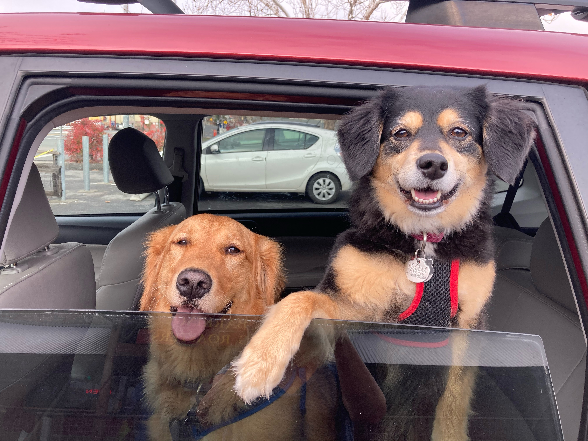

 
```{r setup, include = FALSE}
knitr::opts_chunk$set(echo = FALSE)
```
 
#### Interests:
 
I am interested in forestry, fire ecology, and global change. Particularly, I am interested in the intricacies of managing forested lands for ecological resilience using fire, and the ways in which management practices intersect with the needs of communities living in or near fire-risk areas. I am specializing in Conservation Plannning at the Bren School with the goal of working in environmental planning in the future, and am pursuing a focus in strategic environmental communications because developing effective management plans depends on building open relationships and clear communication with communities.

#### Experience:

While completing my Bachelor's in biological science at UC Davis, I worked on field studies researching the reproductive success of songbirds and in a genetics laboratory exploring the evolution of sociality in bees. After graduation, I worked as an environmental educator at Sonoma Water, leading classroom lessons and field-trips for elementary-aged children. Our lessons focused on climate change, salmonid diversity, and pollution prevention.

{width=75%}


At Bren, I have taken courses in data analysis, GIS, and forest sustainability. I plan to continue to build these technical skills throughout the rest of my time in school.

{width=75%}
