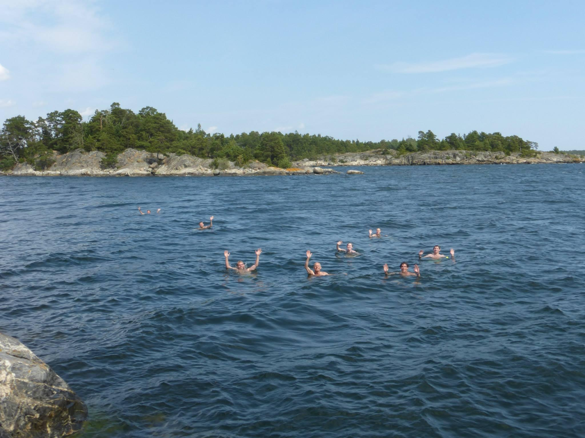

 
```{r setup, include = FALSE}
knitr::opts_chunk$set(echo = FALSE)
```
 
I am originally from Sonoma, CA, but spent every summer in my childhood visiting family in Sweden. The gorgeous countryside and sprawling archipelago, combined with my family's love of hiking and skiing, sparked an early passion for the outdoors which has led me to Bren.

{width=100%}

For my undergraduate degree, I attended the University of California, Davis. There I pursued a Bachelor's in Biological Sciences with an emphasis in Evolution, Ecology, and Biodiversity. While studying, I worked as a research assistant in the Ramírez Lab studying the genetics and evolution of eusociality in orchid bees. I also worked as a field intern for several research teams exploring reproductive success of various native bird species. It was at Davis that I fell in love with forest ecology, through classes in tree physiology, plant diversity, and fire ecology.

After graduating, I worked as an environmental educator at Sonoma Water, the water utility for Sonoma County. There, I led classroom lessons and field-trips for elementary-aged children. Our lessons focused on climate change, salmonid diversity, water conservation, and pollution prevention.

{width=100%}

#### Interests:
 
I am interested in forestry, fire ecology, and global change. Particularly, I am interested in the intricacies of managing forested lands for ecological resilience using fire, and the ways in which management practices intersect with the needs of communities living in or near fire-risk areas. I am specializing in Conservation Planning at the Bren School with the goal of working in environmental planning in the future, and am pursuing a focus in strategic environmental communications because developing effective management plans depends on building open relationships and clear communication with communities.

{width=100%}

Outside of school, I love reading, baking, and being outside. Many activities will do, but I particularly love hiking and playing soccer, and when the world reopens I am excited to be able to travel again!

{width=100%}
